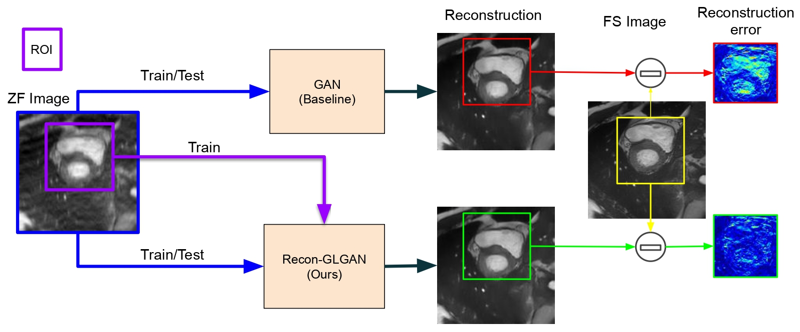
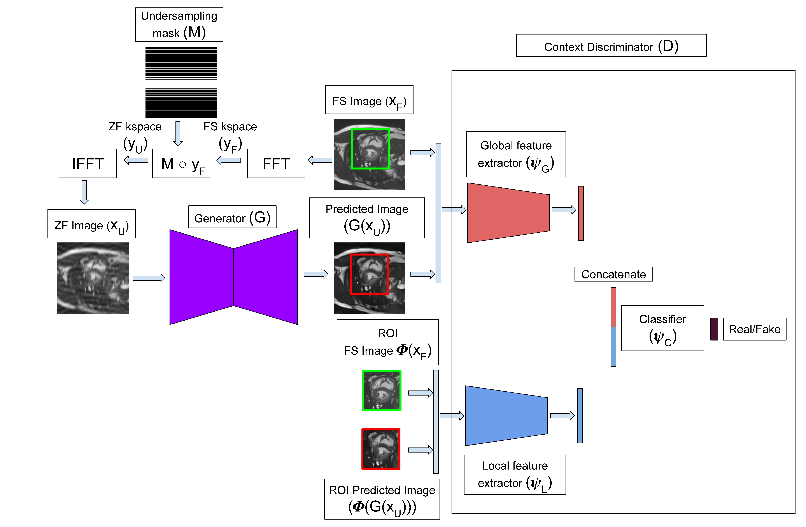
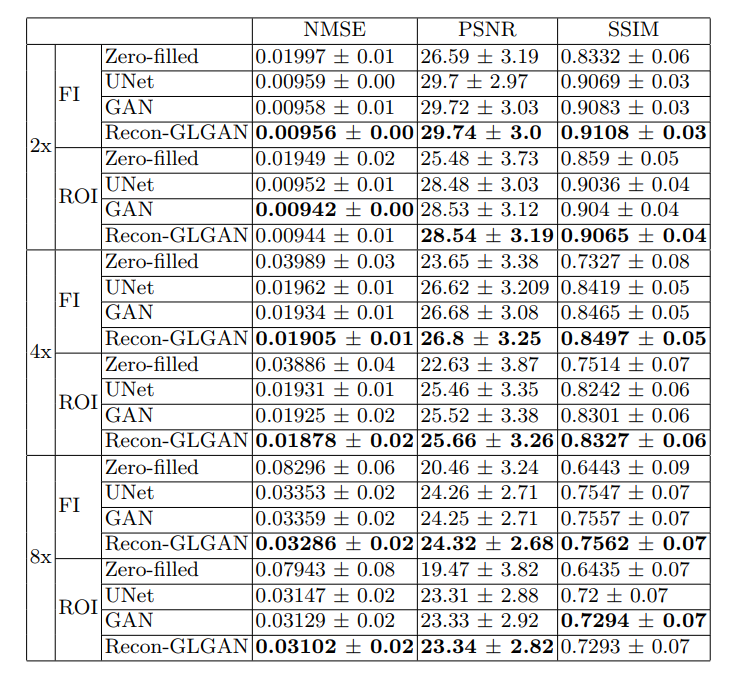
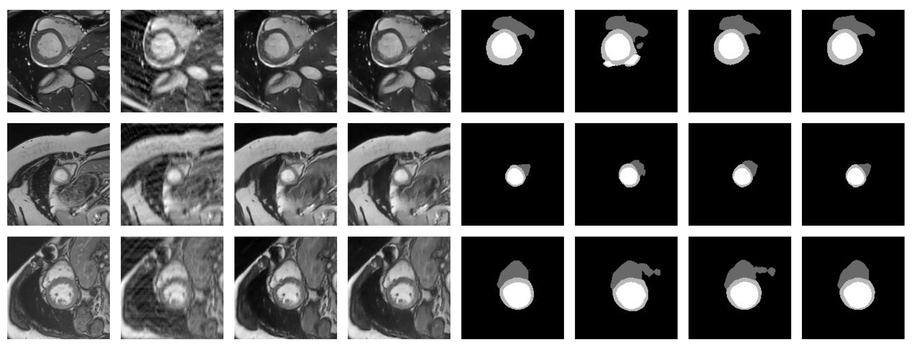
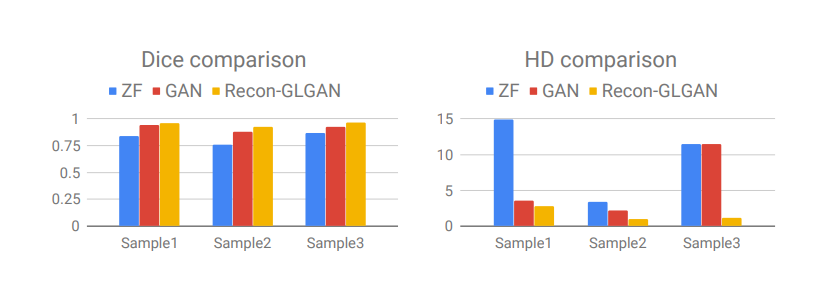

# ReconGLGAN - GANs for MRI Reconstruction

## ReconGLGAN procedure:

## ReconGLGAN architecture:


## Reconstruction qualitative comparison:
From Left to Right: Ground Truth FS image, ZF image, GAN reconstructed
image, Recon-GLGAN reconstructed image, ZF reconstruction error, GAN reconstruction
error and Recon-GLGAN reconstruction error. From Top to Bottom: Images corresponding
to different acceleration factors: 2x, 4x and 8x.


## Reconstruction quantitative comparison:
Comparison of Recon-GLGAN with baseline architectures for 2x, 4x and 8x
accelerations(FI-Full image)



## Segmentation qualitative comparison:
From Left to Right: FS image, ZF image, GAN reconstructed image, Recon-GLGAN reconstructed image, Ground Truth FS segmentation mask, Segmentation mask for ZF, Segmentation mask for GAN reconstructed image and Segmentation mask for Recon-GLGAN reconstructed image. From top to bottom: Sample 1, 2 and 3


## Segmentation Quantitative comparison:
Segmentation metrics: Dice and HD comparison for image samples 1, 2 and 3



This code is based on the [fastMRI code](https://github.com/facebookresearch/fastMRI) from Facebook Research.


## Dataset

TBA

## Training 

Set the appropriate paths to training and test data in ```train.sh```. Then,

```sh train.sh```


## Validation

Set the appropriate path to the model checkpoint in ```valid.sh```. Then,

```sh train.sh```.


## Evaluation

```python common/patch_eval_onecoord.py --target-path [PATH_TO_TARGET_DATA] --predictions-path [PATH_TO_PREDICTED_OUTPUTS] --acceleration [] --roi-size [SIZE_OF_ROI]```