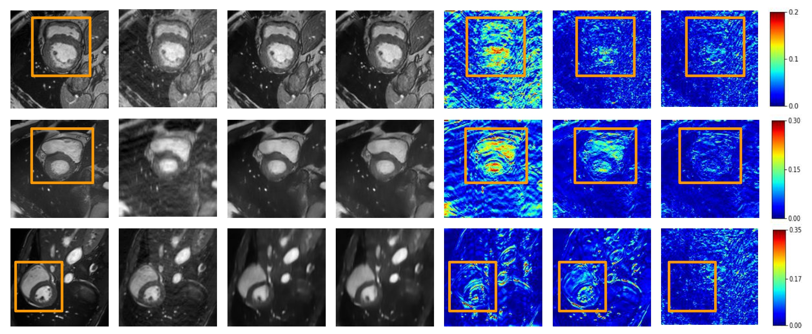

## [Recon-GLGAN: A Global-Local context based Generative Adversarial Network for MRI Reconstruction(Accepted at Machine Learning in Medical Image Reconstruction(MLMI), MICCAI Workshop)](https://arxiv.org/abs/1908.09262)

## ReconGLGAN illustration:

## ReconGLGAN architecture:


## Reconstruction qualitative comparison:
From Left to Right: Ground Truth FS image, ZF image, GAN reconstructed
image, Recon-GLGAN reconstructed image, ZF reconstruction error, GAN reconstruction
error and Recon-GLGAN reconstruction error. From Top to Bottom: Images corresponding
to different acceleration factors: 2x, 4x and 8x.


## Reconstruction quantitative comparison:
Comparison of Recon-GLGAN with baseline architectures for 2x, 4x and 8x
accelerations(FI-Full image)


## Segmentation qualitative comparison:
From Left to Right: FS image, ZF image, GAN reconstructed image, Recon-GLGAN reconstructed image, Ground Truth FS segmentation mask, Segmentation mask for ZF, Segmentation mask for GAN reconstructed image and Segmentation mask for Recon-GLGAN reconstructed image. From top to bottom: Sample 1, 2 and 3


## Segmentation Quantitative comparison:
Segmentation metrics: Dice and HD comparison for image samples 1, 2 and 3


This code is based on the [fastMRI code](https://github.com/facebookresearch/fastMRI) from Facebook Research.


## Dataset creation

Each h5 file denotes a volume, the h5 file contains fully sampled and 2x,4x,8x under sampled images

Note: We will upload the code for data creation. The dataset can be created according to the need and data/mri_data.py can be changed accordingly. In our case, the keys are volfs,volus_2x,volus_4x and volus_8x. The coordinate to crop the ROI is also stored in h5 using center_coord key. 

## Training 
### GAN 
```
TRAIN_PATH=''
VALIDATION_PATH=''
EXP_DIR='' # folder to save models and write summary
ACCELERATION=''
python models/gan/train.py --train-path ${TRAIN_PATH} --val-path ${VALIDATION_PATH} --exp-dir ${EXP_DIR} --acceleration ${ACCELERATION}
```
### Recon-GLGAN
```
TRAIN_PATH=''
VALIDATION_PATH=''
EXP_DIR='' # folder to save models and write summary
ACCELERATION=''
python models/recon_glgan/train.py --train-path ${TRAIN_PATH} --val-path ${VALIDATION_PATH} --exp-dir ${EXP_DIR} --acceleration ${ACCELERATION}
```

## Validation
### GAN
```
VAL_PATH='' #validation path 
ACCELERATION='' #acceleration factor
CHECKPOINT='' #best_model.
OUT_DIR='' # Path to save reconstruction files 
python models/gan/run.py --checkpoint ${CHECKPOINT} --out-dir ${OUT_DIR}
```
### Recon-GLGAN
```
VAL_PATH='' #validation path 
ACCELERATION='' #acceleration factor
CHECKPOINT='' #best_model.
OUT_DIR='' # Path to save reconstruction files 
python models/recon_glgan/run.py --checkpoint ${CHECKPOINT} --out-dir ${OUT_DIR}
```

## Evaluation
The evaluation code will return the average metrics for the entire image and the ROI. 
```
TARGET_PATH=''
PREDICTIONS_PATH=''
ROI_SIZE=''
python common/evaluate.py --target-path ${TARGET_PATH} --predictions-path ${PREDICTIONS_PATH} --roi-size ${ROI_SIZE}
```
